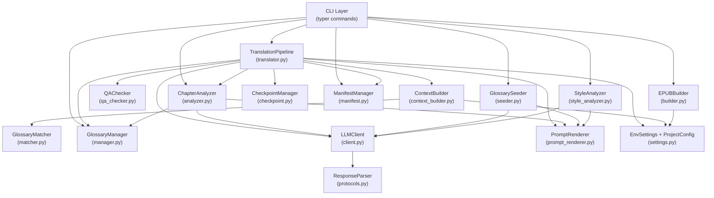
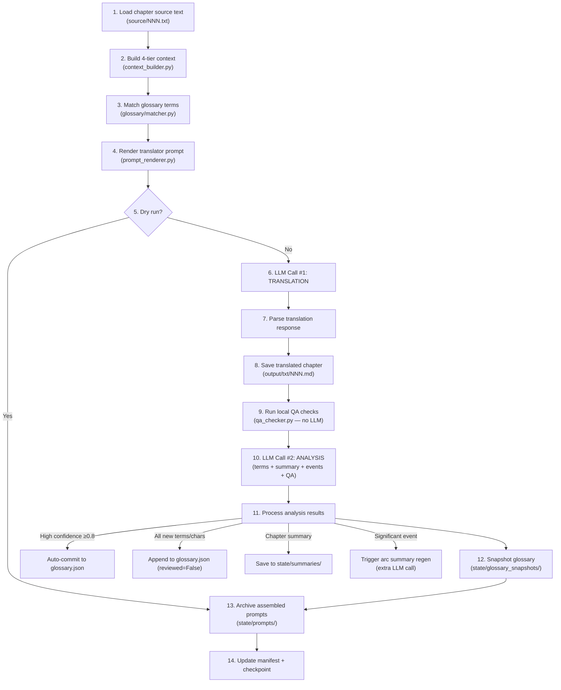

# noveltrans — Architecture Guide

> **Purpose**: This document is the single-source-of-truth for understanding the `noveltrans` codebase. It is written for both human developers and AI agents performing future modifications, debugging, or feature additions.

## Table of Contents

- [System Overview](#system-overview)
- [Technology Stack](#technology-stack)
- [Project Layout](#project-layout)
- [Module Architecture](#module-architecture)
- [Data Flow: Per-Chapter Translation Pipeline](#data-flow-per-chapter-translation-pipeline)
- [4-Tier Context System](#4-tier-context-system)
- [Data Models Reference](#data-models-reference)
- [Configuration System](#configuration-system)
- [Prompt Templates](#prompt-templates)
- [CLI Commands](#cli-commands)
- [Glossary Matching Engine](#glossary-matching-engine)
- [QA Checker](#qa-checker)
- [State Management](#state-management)
- [EPUB Compilation](#epub-compilation)
- [Multi-Language Support (CJK)](#multi-language-support-cjk)
- [Test Suite](#test-suite)
- [Extension Guide](#extension-guide)
- [Codebase Statistics](#codebase-statistics)

---

## System Overview

`noveltrans` is a CLI tool that translates CJK (Korean, Japanese, Chinese) web novels into English using LLM APIs. It is **not** a simple wrapper — it maintains rich persistent context across chapters to produce coherent, high-quality translations across an entire novel.

### Key Design Principles

1. **2 LLM calls per chapter**: One for translation, one for merged post-translation analysis (term extraction + summary + events + QA flags). This is a hard constraint.
2. **4-tier context**: Every translation prompt includes layered context from style guide → story summary → arc summary → recent chapters.
3. **Enriched character modeling**: Characters have per-alias gender, `knows_identity` tracking, and relationship graphs — enabling pronoun-aware translation.
4. **Non-blocking QA**: Quality issues are logged but never stop translation. The user reviews issues after the fact.
5. **Full state persistence**: Every chapter produces glossary snapshots, prompt archives, chapter summaries, and manifest entries. Nothing is lost.
6. **Model-agnostic**: Uses OpenAI-compatible API endpoints. Default points to Gemini's OpenAI endpoint but works with any provider.

---

## Technology Stack

| Component | Technology | Purpose |
|---|---|---|
| CLI framework | `typer` + `rich` | Command-line interface with styled terminal output |
| Data models | `pydantic` v2 | Type-safe models for glossary, state, config |
| Config | `pydantic-settings` | Environment variable loading with `.env` layering |
| LLM client | `openai` (async) | OpenAI-compatible API calls |
| Templates | `jinja2` | Prompt template rendering |
| Text matching | `ahocorasick-rs` | O(N) exact matching |
| EPUB | `ebooklib` | EPUB3 compilation |
| Logging | `structlog` | Structured logging with Rich console output |
| Testing | `pytest` + `pytest-asyncio` | Unit and integration tests |
| Linting | `ruff` | Code style enforcement |
| Type checking | `basedpyright` | Static type analysis |

---

## Project Layout

```
noveltrans/
├── pyproject.toml                  # Build config, dependencies, tool settings
├── .env.example                    # Template for API configuration
├── README.md                       # User-facing documentation
├── ARCHITECTURE.md                 # This file
├── PROJECT.md                      # Milestone tracking (build history)
│
├── src/noveltrans/                 # Main package (2,829 lines across 34 files)
│   ├── __init__.py                 # Package root, version constant
│   ├── __main__.py                 # `python -m noveltrans` entry point
│   │
│   ├── config/                     # Configuration layer
│   │   └── settings.py             # EnvSettings + ProjectConfig models
│   │
│   ├── glossary/                   # Glossary management system
│   │   ├── models.py               # Character, CharacterAlias, Relationship, GlossaryTerm, Glossary
│   │   ├── manager.py              # CRUD operations on glossary.json
│   │   └── matcher.py              # Aho-Corasick + RapidFuzz term matching
│   │
│   ├── state/                      # State persistence
│   │   ├── models.py               # QAIssue, SignificantEvent, ChapterManifestEntry, etc.
│   │   ├── checkpoint.py           # CheckpointManager — resume interrupted runs
│   │   └── manifest.py             # ManifestManager — per-chapter metadata tracking
│   │
│   ├── llm/                        # LLM abstraction layer
│   │   ├── client.py               # Async OpenAI client with exponential backoff
│   │   ├── protocols.py            # ResponseParser protocol + StructuredOutput/PromptBased parsers
│   │   └── prompt_renderer.py      # Jinja2 template loading and rendering
│   │
│   ├── core/                       # Business logic
│   │   ├── translator.py           # TranslationPipeline — 14-step per-chapter orchestration
│   │   ├── context_builder.py      # 4-tier context assembly
│   │   ├── analyzer.py             # Post-translation analysis (terms, summaries, events)
│   │   ├── seeder.py               # Glossary bootstrap from raw chapters
│   │   ├── style_analyzer.py       # Style guide generation from source text
│   │   └── qa_checker.py           # Non-LLM automated quality checks
│   │
│   ├── epub/                       # EPUB generation
│   │   └── builder.py              # Markdown → EPUB3 compilation
│   │
│   └── cli/                        # CLI interface (typer commands)
│       ├── app.py                  # Root app + subcommand registration
│       ├── init_cmd.py             # `noveltrans init`
│       ├── translate_cmd.py        # `noveltrans translate run`
│       ├── glossary_cmd.py         # `noveltrans glossary seed/show/review`
│       ├── epub_cmd.py             # `noveltrans epub build`
│       ├── style_cmd.py            # `noveltrans style analyze`
│       ├── summary_cmd.py          # `noveltrans arc update` / `noveltrans story update`
│       └── status_cmd.py           # `noveltrans status`
│
├── prompts/                        # Jinja2 prompt templates (6 files, 182 lines)
│   ├── translator.jinja2           # Main translation prompt
│   ├── analyzer.jinja2             # Post-translation analysis prompt
│   ├── seeder.jinja2               # Glossary bootstrap prompt
│   ├── style_analyzer.jinja2       # Style guide generation prompt
│   ├── arc_summary.jinja2          # Arc summary regeneration prompt
│   └── story_summary.jinja2        # Story summary regeneration prompt
│
└── tests/                          # Test suite (3,745 lines across 17 files, 169 tests)
    ├── conftest.py                 # Central fixture hub (433 lines)
    ├── test_cli.py                 # CLI integration tests (851 lines, 55 tests)
    ├── test_glossary_matcher.py    # Aho-Corasick matching tests
    ├── test_context_builder.py     # 4-tier assembly tests
    ├── test_checkpoint.py          # Checkpoint save/load/resume tests
    ├── test_manifest.py            # Manifest tracking tests
    ├── test_qa_checker.py          # QA detection tests (Korean/Japanese/Chinese)
    ├── test_prompt_renderer.py     # Template rendering + multi-language tests
    ├── test_epub_builder.py        # EPUB generation tests
    ├── test_translator.py          # Full pipeline tests
    ├── test_analyzer.py            # Post-translation analysis tests
    ├── test_seeder.py              # Glossary seeding tests
    ├── test_style_analyzer.py      # Style analysis tests
    ├── test_llm.py                 # LLM client + parser tests
    ├── test_glossary_manager.py    # Glossary CRUD tests
    └── test_conftest_fixtures.py   # Fixture sanity tests
```

---

## Module Architecture



### Dependency Flow

Dependencies flow **downward**. The CLI layer depends on core, core depends on glossary/llm/state, and config is shared by all layers. No circular dependencies exist.

---

## Data Flow: Per-Chapter Translation Pipeline

This is the central orchestration loop in `translator.py`. Each chapter executes exactly these 14 steps:



### Step 11 Detail: Analysis Result Processing

| Sub-step | Condition | Action |
|---|---|---|
| 11a | Term confidence ≥ 0.8 | Auto-commit to `glossary.json` |
| 11b | New Characters / Terms | Extracted entities are saved to `glossary.json` with internal flag `reviewed=False` |
| 11c | Character/relationship updates | Auto-commit to `glossary.json` |
| 11d | Always | Save chapter summary to `state/summaries/chNNN.json` |
| 11e | `significant_event.triggers_arc_update == True` | Regenerate arc summary (extra LLM call) |
| 11f | Chapters since last arc update ≥ `arc_summary_fallback_interval` (default: 15) | Fallback arc summary regeneration |

---

## 4-Tier Context System

Every translation prompt includes layered context assembled by `ContextBuilder`:

| Tier | Name | Update Frequency | Contents |
|---|---|---|---|
| **1** | Global | Static per session | Style guide text + matched glossary characters (with aliases, gender, speech style, `knows_identity`) + matched terms + relationships + `always_include` characters |
| **2** | Story | Semi-static | Overall story progression summary (updated on arc transitions or manually) |
| **3** | Arc | Semi-static | Current arc summary + last N chapter summaries (default: 5). Updated event-driven + 15-chapter fallback |
| **4** | Immediate | Dynamic | Last 2 full translated chapters (raw markdown text) for tone/style continuity |

### Context Size Management

- `context_recent_chapters: int = 2` — Tier 4 window
- `context_recent_summaries: int = 5` — Tier 3 summary window
- `arc_summary_fallback_interval: int = 15` — chapters before forced arc summary regen

All configurable in `project.json`.

---

## Data Models Reference

### Glossary Models (`glossary/models.py`)

```
Glossary
├── characters: list[Character]
│   ├── id: str                     # Unique ID (e.g., "mc_daisy")
│   ├── canonical_name: str         # Primary English name
│   ├── aliases: list[CharacterAlias]
│   │   ├── source: str             # Original language text
│   │   ├── target: str             # English translation
│   │   ├── gender: str             # Gender for THIS alias (enables disguise handling)
│   │   ├── context: str            # When this alias is used
│   │   └── alias_type: str         # name | title | nickname | disguise
│   ├── gender: str                 # True gender
│   ├── speech_style: str           # How they talk
│   ├── appearance: str
│   ├── knows_identity: list[str]   # Character IDs who know true identity
│   ├── always_include: bool        # Always inject into prompt context
│   └── notes: str
├── terms: list[GlossaryTerm]
│   ├── source: str
│   ├── target: str
│   ├── category: str               # place | organization | title | concept | item | skill
│   ├── notes: str
│   └── confidence: float           # 1.0 = human-verified, <1.0 = auto-extracted
└── relationships: list[Relationship]
    ├── characters: list[str]       # Character IDs involved
    ├── description: str
    └── since_chapter: int | None
```

### State Models (`state/models.py`)

```
TranslationManifest
├── project_title: str
├── chapters: dict[int, ChapterManifestEntry]
│   ├── chapter_number: int
│   ├── status: "pending" | "in_progress" | "completed" | "failed"
│   ├── translated_at: datetime | None
│   ├── model_used: str | None
│   ├── glossary_snapshot: str | None
│   ├── translation_duration_seconds: float
│   ├── new_terms_extracted: int
│   ├── force_retranslated: bool
│   ├── qa_issues: list[QAIssue]
│   │   ├── issue_type: "untranslated_korean" | "untranslated_japanese" | "untranslated_chinese"
│   │   │              | "missing_glossary_term" | "repetition_loop" | "hallucinated_filler"
│   │   │              | "length_anomaly"
│   │   ├── description: str
│   │   └── severity: "warning" | "error"
│   └── significant_events: list[SignificantEvent]
│       ├── event_type: "identity_reveal" | "power_reveal" | "relationship_change"
│       │              | "new_location" | "major_conflict" | "arc_transition"
│       ├── description: str
│       ├── affects_characters: list[str]
│       └── triggers_arc_update: bool
└── last_translated_chapter: int

CheckpointData
├── last_completed_chapter: int
├── current_batch: list[int]
└── batch_start_time: datetime | None
```

### LLM Response Models (`llm/protocols.py`)

```
TranslationResult          # Output of LLM call #1
├── translated_text: str
└── translator_notes: str

AnalysisResult             # Output of LLM call #2
├── summary: str
├── key_events: list[str]
├── characters_present: list[str]
├── new_characters: list[Character]
├── new_terms: list[GlossaryTerm]
├── character_updates: list[dict]
├── relationship_updates: list[Relationship]
├── significant_events: list[SignificantEvent]
└── qa_flags: list[str]

SeedResult                 # Output of glossary seed call
├── characters: list[Character]
├── terms: list[GlossaryTerm]
├── relationships: list[Relationship]
├── story_summary: str
└── arc_summary: str
```

---

## Configuration System

### Two-Layer `.env` Loading

```
~/.config/noveltrans/.env    ← Global defaults (API key, model, base URL)
./project/.env               ← Per-project overrides (optional)
```

`EnvSettings` (via `pydantic-settings`) loads global first, then project `.env` overrides.

### `project.json` (per-project)

Created by `noveltrans init`. Contains project metadata and tuning knobs:

```json
{
  "title": "My Novel",
  "author": "",
  "source_language": "ko",
  "target_language": "en",
  "source_dir": "source",
  "output_dir": "output",
  "state_dir": "state",
  "glossary_path": "glossary.json",
  "style_guide_path": "style_guide.md",
  "prompts_dir": "prompts",
  "context_recent_chapters": 2,
  "context_recent_summaries": 5,
  "arc_summary_fallback_interval": 15
}
```

---

## Prompt Templates

All 6 templates live in `prompts/` and are copied to each project on `init`. Users can edit project-local copies.

| Template | LLM Call | Key Variables | Language-Specific Logic |
|---|---|---|---|
| `translator.jinja2` | Translation | `source_text`, `style_guide`, `matched_characters`, `matched_terms`, `relationships`, `story_summary`, `arc_summary`, `recent_summaries`, `recent_chapters`, `source_language` | Japanese: preserve honorifics (-san, -sama, etc.). Korean/Chinese: translate honorifics. |
| `analyzer.jinja2` | Analysis | `source_text`, `translated_text`, `existing_characters`, `existing_terms`, `source_language` | Chinese: note Simplified vs Traditional consistency |
| `seeder.jinja2` | Seed | `project_title`, `sample_chapters`, `source_language` | Chinese: note Simplified vs Traditional |
| `style_analyzer.jinja2` | Style | `sample_text`, `source_language_name` | — |
| `arc_summary.jinja2` | Arc regen | `previous_arc_summary`, `recent_chapter_summaries`, `significant_events` | — |
| `story_summary.jinja2` | Story regen | `previous_story_summary`, `arc_summaries`, `key_events` | — |

### Template Resolution Order

`PromptRenderer` resolves templates in this priority:
1. Project-local `prompts/` directory
2. Repository-root `prompts/` directory
3. Package-bundled prompts (via `PackageLoader`)

---

## CLI Commands

| Command | Description | Key Options |
|---|---|---|
| `noveltrans init <path>` | Scaffold a new translation project | `--language ko\|ja\|zh` |
| `noveltrans translate run` | Translate chapters | `--chapters`, `--force`, `--dry-run`, `--skip-glossary`, `--project` |
| `noveltrans glossary seed` | Bootstrap glossary from raw chapters | `--chapters`, `--update-summaries`, `--project` |
| `noveltrans glossary show` | Pretty-print glossary | `--project` |
| `noveltrans glossary review` | Interactively review newly extracted terms (LLM alternatives) | `--project`, `--skip-llm` |
| `noveltrans style analyze` | Generate/update style guide | `--chapters`, `--project` |
| `noveltrans arc update` | Regenerate arc summary | `--project` |
| `noveltrans story update` | Regenerate story summary | `--project` |
| `noveltrans epub build` | Compile translated chapters to EPUB | `--chapters`, `--title`, `--author`, `--project` |
| `noveltrans status` | Show translation progress and QA issues | `--project` |

---

## Glossary Matching Engine

`GlossaryMatcher` uses a single-stage high-performance exact matching approach:

### Aho-Corasick Exact Matching
- Builds an automaton from all glossary source terms (character aliases + term sources)
- Scans chapter text in **O(N)** time
- Returns exact substring matches

### Always-Include Injection
- Characters with `always_include=True` are always injected into context regardless of whether they appear in the current chapter text

---

## QA Checker

`QAChecker` runs **no LLM calls** — pure regex and heuristic checks:

| Check | Detection Method | Issue Type |
|---|---|---|
| Untranslated Korean | `[\uAC00-\uD7A3]+` regex | `untranslated_korean` |
| Untranslated Japanese | `[\u3040-\u309F\u30A0-\u30FF\u4E00-\u9FFF]+` regex | `untranslated_japanese` |
| Untranslated Chinese | `[\u4E00-\u9FFF\u3400-\u4DBF]+` regex | `untranslated_chinese` |
| LLM filler phrases | String matching ("as an ai language model", etc.) | `hallucinated_filler` |
| Repetition loops | Consecutive identical line detection | `repetition_loop` |
| Missing glossary terms | Check if matched terms appear in output | `missing_glossary_term` |
| Length anomaly | Output/source ratio < 20% | `length_anomaly` |

**Critical**: QA issues are **logged only** — they never block translation.

---

## State Management

### Translation Project Directory

```
my_novel/
├── source/                     # User drops .txt files here
│   ├── 001.txt
│   └── 002.txt
├── output/
│   ├── txt/                    # Translated markdown chapters
│   │   ├── 001.md
│   │   └── 002.md
│   └── epub/
│       └── novel.epub
├── state/
│   ├── checkpoint.json         # Resume point for interrupted runs
│   ├── manifest.json           # Per-chapter metadata (status, QA issues, events)
│   ├── summaries/              # Chapter summaries (JSON, one per chapter)
│   ├── story_summary.json      # Overall story progression
│   ├── arc_summary.json        # Current arc summary
│   ├── glossary_snapshots/     # Historical glossary versions (one per chapter)
│   ├── prompts/                # Archived assembled prompts (for debugging)

├── prompts/                    # Project-local Jinja2 templates (editable)
├── glossary.json               # Active glossary
├── style_guide.md              # Translation style guide
├── project.json                # Project configuration
└── .env                        # Optional per-project API overrides
```

### Checkpoint System

- `CheckpointManager` saves after each chapter: `last_completed_chapter`, `current_batch`, `batch_start_time`
- On resume: skips chapters where `chapter_number <= last_completed_chapter` (unless `--force`)
- `--force` flag bypasses skip logic for specific chapters

### Glossary Snapshots

After each chapter translation, the entire glossary state is saved to `state/glossary_snapshots/glossary_chNNN.json`. This enables:
- Auditing what glossary state was used for each chapter
- Rollback if a bad term was auto-committed

---

## Multi-Language Support (CJK)

The tool supports Korean (`ko`), Japanese (`ja`), and Chinese (`zh`) as source languages.

| Feature | Korean (`ko`) | Japanese (`ja`) | Chinese (`zh`) |
|---|---|---|---|
| Honorifics | Fully translate | **Preserve** (-san, -sama, etc.) | Fully translate |
| QA regex | `[\uAC00-\uD7A3]+` | `[\u3040-\u309F\u30A0-\u30FF\u4E00-\u9FFF]+` | `[\u4E00-\u9FFF\u3400-\u4DBF]+` |
| Prompt language | `{{ source_language_name }}` = "Korean" | "Japanese" | "Chinese" |
| Special notes | — | — | Simplified vs Traditional consistency |

Language is set at project creation: `noveltrans init ./project --language ja`

All language-specific logic is parameterized by `source_language` in `project.json` — there is no hardcoded language anywhere in the codebase.

---

## Test Suite

**169 tests** across 17 files. All tests use **mocked LLM responses** — no real API calls.

### Test Coverage by Module

| Module | Test File | Tests | Key Coverage |
|---|---|---|---|
| Glossary matching | `test_glossary_matcher.py` | 10 | Aho-Corasick, always_include, deduplication |
| Glossary CRUD | `test_glossary_manager.py` | 2 | Save/load roundtrip, pending terms approval |
| Context builder | `test_context_builder.py` | 3 | 4-tier assembly, always_include injection |
| Checkpoint | `test_checkpoint.py` | 13 | Save/load, resume, force skip, corruption recovery |
| Manifest | `test_manifest.py` | 13 | CRUD, QA issues, events, stats, corruption recovery |
| QA checker | `test_qa_checker.py` | 15 | Korean/Japanese/Chinese regex, filler, repetition, non-blocking |
| Prompt renderer | `test_prompt_renderer.py` | 15 | All 6 templates, Japanese honorifics, Chinese variants |
| EPUB builder | `test_epub_builder.py` | 11 | EPUB3 validity, partial builds, CSS, TOC |
| LLM client | `test_llm.py` | 4 | Parser strategies, exponential backoff |
| Translator pipeline | `test_translator.py` | 7 | Full 14-step flow, dry-run, force, batch resume |
| Analyzer | `test_analyzer.py` | 6 | Term filtering, character updates, summary persistence |
| Seeder | `test_seeder.py` | 2 | Async/sync seed, file-based seed |
| Style analyzer | `test_style_analyzer.py` | 2 | Style guide generation |
| CLI commands | `test_cli.py` | 55 | All 10 commands, boundary cases, cross-command flows |
| Fixtures | `test_conftest_fixtures.py` | 8 | Fixture sanity validation |

### Running Tests

```bash
# Full suite
uv run pytest tests/ -v

# Type checking
uv run basedpyright src/

# Linting
uv run ruff check src/ tests/
```

---

## Extension Guide

### Adding a New CLI Command

1. Create `src/noveltrans/cli/new_cmd.py`
2. Define a `typer.Typer()` app or standalone command function
3. Register in `src/noveltrans/cli/app.py` via `app.add_typer()` or `app.command()`
4. Add tests in `tests/test_cli.py`

### Adding a New Prompt Template

1. Create `prompts/new_template.jinja2`
2. Use `{{ source_language_name }}` for language-aware content
3. Add a `render_new_template()` method to `PromptRenderer`
4. Template is auto-copied to projects on `noveltrans init`

### Adding a New QA Check

1. Add detection logic in `QAChecker.check_chapter()`
2. Add new issue type to `QAIssue.issue_type` Literal union in `state/models.py`
3. Add tests in `tests/test_qa_checker.py`
4. **Never** make QA checks blocking

### Adding a New Source Language

1. Add Unicode regex to `QAChecker.UNTRANSLATED_REGEXES` dict
2. Add language name to `PromptRenderer.LANGUAGE_NAMES` dict
3. Add honorifics policy logic to `translator.jinja2` template
4. Update `init_cmd.py` to accept the new language code
5. Add tests for the new language in `test_qa_checker.py` and `test_prompt_renderer.py`

### Modifying the Translation Pipeline

The 14-step flow in `translator.py` is the most critical code path. If you modify it:
- Maintain the **2 LLM calls per chapter** invariant
- Ensure all state artifacts are still persisted (glossary snapshot, prompt archive, summary, manifest, checkpoint)
- Run the full test suite — `test_translator.py` covers the end-to-end flow

---

## Codebase Statistics

| Metric | Value |
|---|---|
| Source files | 34 files |
| Source lines | 2,829 |
| Test files | 17 files |
| Test lines | 3,745 |
| Prompt templates | 6 files (182 lines) |
| Total tests | 169 |
| Dependencies | 11 runtime + 4 dev |
| Python version | ≥ 3.12 |
